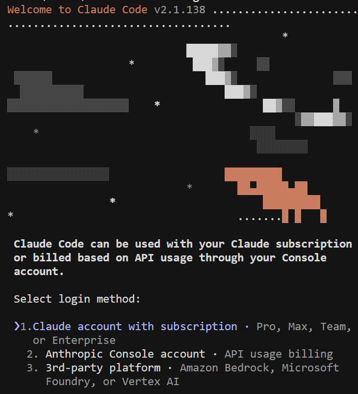
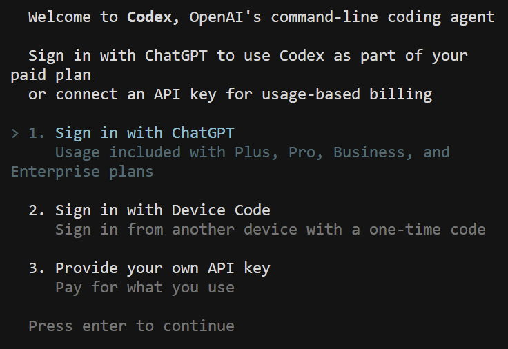

# Tools

The primary tools installed for this setup were Claude Code and Codex. Both tools are AI-assisted development environments that support coding, research, workflow automation, analysis, and productivity tasks. These tools are commonly used to streamline technical workflows, assist with problem-solving, and improve efficiency during research and project execution.

# Steps

Initially, I attempted to install both tools directly through the Extensions Marketplace in Cursor. However, the required extensions were not available in the marketplace interface. As an alternative approach, I completed the installation through the terminal using CLI commands.

Installed via terminal:  
`npm install -g @anthropic-ai/claude-code`  
`npm install -g @openai/codex`

Both installations were completed successfully and verified through terminal execution. Screenshots of the successful installation and CLI launch process are attached below. 

Screenshot for Claude installation:  

Screenshot for Codex installation:  

The login step was not fully completed because the available authentication methods required paid subscription access or API-based billing plans.

# Issues

here were no major technical issues during the setup process. The only minor challenge was recalling several CLI commands and environment setup steps, since I had not used these specific tools recently. However, the workflow remained familiar overall due to prior experience working with coding environments, version control systems, and repository management tools such as GitHub and GitLab throughout academic and project-based work. The setup process was completed smoothly, and the tools were installed and executed successfully in the local environment.